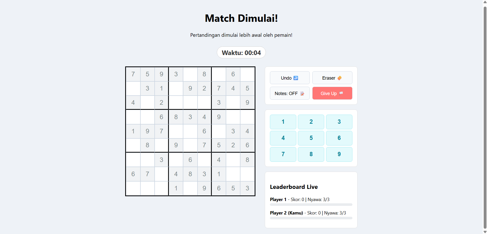

# ⚔️ Sudoku PvP Arena (Multiplayer Backend-Authoritative)

Sebuah aplikasi permainan Sudoku multipemain (*multiplayer*) berbasis web yang mengimplementasikan pemrograman jaringan asinkron menggunakan **Golang (WebSockets)** di sisi *backend* dan **HTML5/CSS3/JavaScript murni** di sisi *frontend*.

Aplikasi ini menggunakan pendekatan **Server-Authoritative**, di mana seluruh logika pembuatan papan, validasi jawaban, kalkulasi skor, serta sinkronisasi status permainan dikelola penuh oleh server untuk mencegah manipulasi data (*cheat*) dari sisi klien.

---

## 📸 Screenshot Aplikasi

Berikut adalah tampilan antarmuka *Sudoku PvP Arena* saat pertandingan sedang berlangsung secara multipemain:



---

## 🚀 Fitur Utama

* **Dynamic Matchmaking Lobby:** Pertandingan didesain untuk maksimal 4 pemain, namun mendukung fitur **START NOW** (Mulai Manual) jika minimal sudah ada 2 pemain di lobi untuk memangkas waktu tunggu.
* **Real-Time Sync & Leaderboard:** Skor, tingkat progres, dan status eliminasi pemain disinkronkan secara instan ke seluruh pemain yang terhubung menggunakan koneksi WebSocket dupleks penuh (*full-duplex*).
* **Elimination System:** Setiap pemain dibekali 3 kesempatan hidup (*Mistake Limit*). Pemain yang salah menjawab sebanyak 3 kali akan otomatis tereliminasi (**ELIMINATED**).
* **Last Man Standing (Auto-Win):** Jika semua lawan telah gugur atau menyerah (*Give Up*), server akan otomatis menghentikan permainan dan menobatkan satu-satunya pemain yang tersisa sebagai pemenang mutlak.
* **Integrated Game Tools & Touch Controls:** Dilengkapi dengan stopwatch waktu pengerjaan secara *real-time*, fungsionalitas tombol *Undo*, *Eraser*, *Notes*, serta panel tombol angka (*on-screen numpad*) yang ramah untuk perangkat layar sentuh seperti tablet atau HP.
* **Anti-Cheat Input Lock:** Kotak kosong yang berhasil dijawab dengan benar akan otomatis dikunci secara permanen di sisi server dan klien untuk menghindari eksploitasi penimbunan skor.

---

## 🛠️ Arsitektur Teknologi

* **Backend:** Go (Golang) versi 1.25.7
* **Library Utama Backend:** `github.com/gorilla/websocket` (Protokol komunikasi real-time bertenaga tinggi)
* **Frontend:** HTML5, CSS3 (External Stylesheet terpisah), JavaScript Modern (Asynchronous Web API)

---

## 📦 Struktur Direktori Proyek

```text
Sudoku_Multiplayer/
├── main.go               # Logika server utama, generasi papan, & pengelolaan WebSocket Room
├── go.mod                # File definisi modul dan manajemen dependency Go
├── go.sum                # Catatan checksum keamanan library Go
├── README.md             # Dokumentasi proyek
└── static/               # Folder aset statis frontend
    ├── index.html        # Struktur antarmuka dan logika klien JavaScript
    └── style.css         # Desain layout grid, visualisasi status, dan manajemen responsif
    └── tampilan.png      # Screenshot tampilan permainan
```

## 🏁 Cara Menjalankan Aplikasi di Lokal

### 1. Prasyarat
Pastikan Anda sudah menginstal **Go** di perangkat Anda. Jika belum, silakan unduh di [golang.org](https://golang.org/).

### 2. Instalasi Dependency
Buka terminal Anda di direktori utama proyek (`Sudoku_Multiplayer`), lalu jalankan perintah berikut untuk mengunduh library WebSocket yang diperlukan:

```bash
go mod tidy
```

### 3. Menjalankan Server
Eksekusi file utama untuk menyalakan server lokal:

```bash
go run main.go
```

Server akan aktif secara otomatis di alamat http://localhost:8080.

### 4. Memulai Permainan (Simulasi Multiplayer)
- Buka browser Anda (misalnya Google Chrome) dan akses http://localhost:8080 untuk masuk sebagai Player 1.

- Untuk mensimulasikan pemain lain, buka tab baru menggunakan Mode Penyamaran (Incognito Window) atau gunakan browser yang berbeda (seperti Microsoft Edge/Firefox) di alamat yang sama (http://localhost:8080) untuk masuk sebagai Player 2, Player 3, dan Player 4.

- Jika lobi sudah terisi minimal 2 pemain, salah satu pemain bisa menekan tombol START NOW ⚔️ untuk langsung memulai pertandingan!